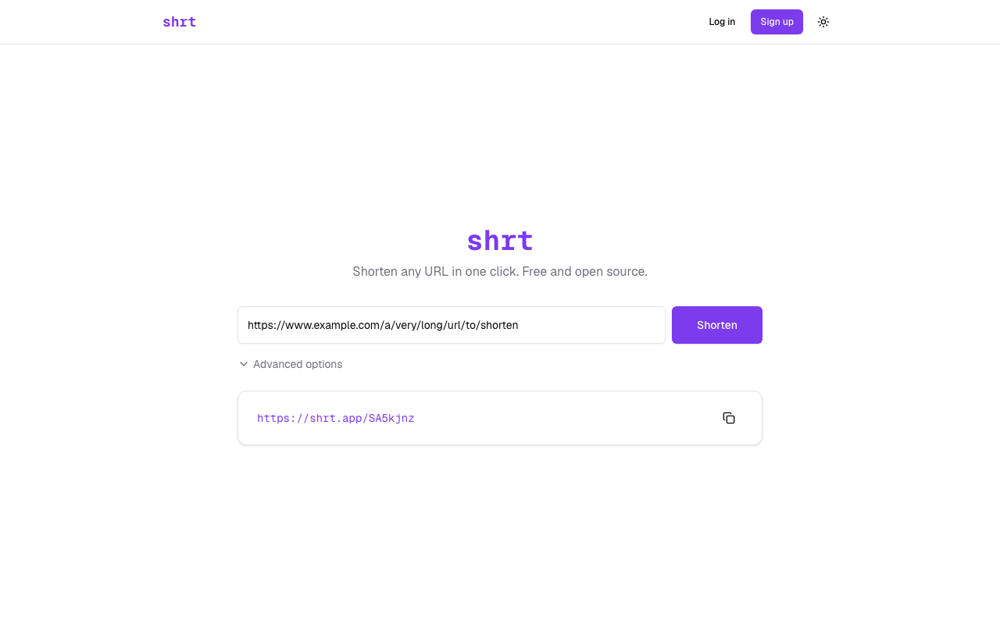
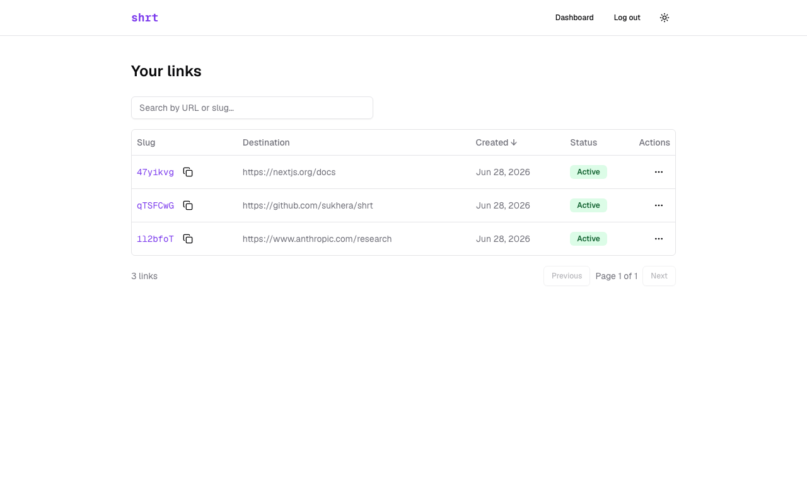

<div align="center">

# shrt

**A clean, self-hostable URL shortener.**

Shorten any URL in one click — no account required. Sign in to manage, edit,
and track your links from a simple dashboard.

[](LICENSE)
[](https://go.dev)
[](https://nextjs.org)
[](https://www.typescriptlang.org)
[](CONTRIBUTING.md)

</div>

---

## Screenshots

| Home | Dashboard |
|:----:|:---------:|
|  |  |

## Features

- **Instant shortening** — paste a URL and get a short link; no sign-up needed
- **Custom aliases & expiry** — pick your own slug and an expiration date
- **Dashboard** — search, sort, edit, and delete your links
- **Fast redirects** — Redis cache-aside in front of Postgres
- **Safe by default** — optional Google Safe Browsing checks, per-IP/user rate limiting
- **Secure auth** — JWT (RS256) with httpOnly refresh-token cookies
- **Dark mode** — system-aware, with a manual toggle
- **Self-hostable** — a single Go binary plus a Next.js app; runs anywhere

## Tech stack

| Layer | Technology |
|-------|------------|
| Backend | Go 1.25, [chi](https://github.com/go-chi/chi), [pgx](https://github.com/jackc/pgx), [sqlc](https://sqlc.dev), [go-redis](https://github.com/redis/go-redis) |
| Database | PostgreSQL 15 |
| Cache | Redis 7 |
| Frontend | Next.js 16 (App Router), TypeScript, Tailwind CSS, [shadcn/ui](https://ui.shadcn.com) |
| Auth | JWT RS256 — 1h access token, 30d refresh token |
| Testing | `go test`, Playwright (E2E) |

## Quick start

**Prerequisites:** Go 1.25+, Node 20+, Docker, and `make`.

```bash
# 1. Clone
git clone https://github.com/sukhera/shrt.git
cd shrt

# 2. Configure
cp .env.example .env

# 3. Generate the JWT signing keys
mkdir -p backend/keys
openssl genrsa -out backend/keys/private.pem 2048
openssl rsa -in backend/keys/private.pem -pubout -out backend/keys/public.pem

# 4. Install dev tools (air, sqlc, migrate, golangci-lint)
make tools

# 5. Start infrastructure, run migrations, and launch the app
make docker-up
make migrate-up
make dev
```

| Service | URL |
|---------|-----|
| Frontend | http://localhost:3000 |
| API | http://localhost:8080 |
| Health | http://localhost:8080/health |

`make dev` runs the API (hot-reload via [air](https://github.com/air-verse/air))
and the frontend together; `Ctrl+C` stops both. Use `make dev-api` / `make dev-web`
to run them separately.

> **No air?** Run the API directly:
> ```bash
> cd backend && set -a && . ../.env && set +a && go run ./cmd/shrt
> ```

> **Short-link domain.** Short URLs are built from `BASE_URL`. Locally this is the
> API origin (`http://localhost:8080/<slug>`); in production set it to your public
> short domain so links read as `https://your-domain/<slug>`.

## Architecture

A single Go binary serves both the JSON API (`/api/v1/...`) and the redirect
endpoint (`GET /<slug>`). Business logic lives in `store/` — there is no separate
service layer; HTTP handlers only parse requests and write responses.

```
shrt/
├── backend/
│   ├── cmd/shrt/        # entry point
│   ├── server/          # HTTP handlers, routing, middleware
│   ├── store/           # business logic: DB, cache, slug gen, auth
│   ├── internal/config/ # env loading (the only place os.Getenv is used)
│   └── db/              # migrations + sqlc queries
└── frontend/
    ├── app/             # Next.js App Router pages + API routes
    ├── components/      # ui/ (shadcn) and app/ (project components)
    ├── hooks/ lib/      # TanStack Query hooks + typed API client
    └── e2e/             # Playwright tests
```

Redirects use a Redis cache-aside: a slug lookup hits Redis first and falls back
to Postgres on a miss, repopulating the cache. Cache failures never block a
redirect. See [`IMPLEMENTATION-PLAN.md`](IMPLEMENTATION-PLAN.md) for the full
design and the API contract.

## Testing

```bash
# Backend — unit + integration (needs Postgres + Redis running)
make test

# Frontend — type-check + lint
cd frontend && npm run type-check && npm run lint

# End-to-end (Playwright) — needs the full stack running (make dev)
cd frontend
npx playwright install chromium   # first run only
npm run e2e                       # or: npm run e2e:ui
```

The E2E suite covers the critical paths: anonymous shorten → copy → redirect;
register → login → create → edit → delete; and the expired-link 410 response.

## Configuration

All configuration is via environment variables, documented in
[`.env.example`](.env.example). The backend refuses to start if a required
variable is missing. Never commit `.env` or `backend/keys/`.

## Contributing

Contributions are welcome! See [CONTRIBUTING.md](CONTRIBUTING.md) for local setup,
the branch/PR workflow, required checks, and code style.

## License

[MIT](LICENSE) © Ahmed Sukhera
