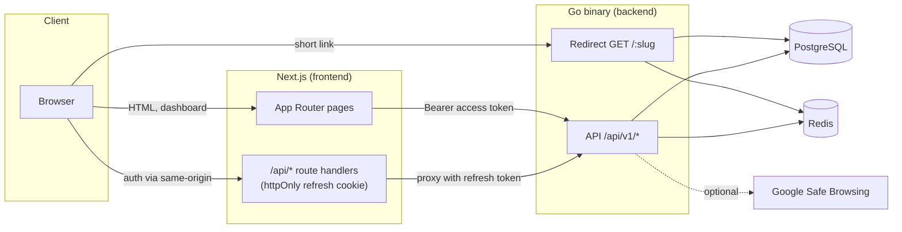
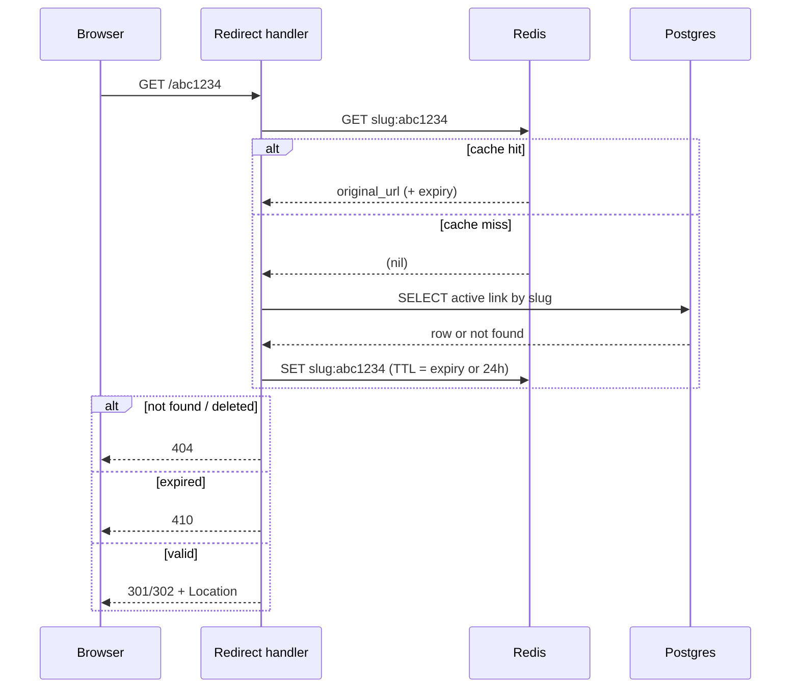
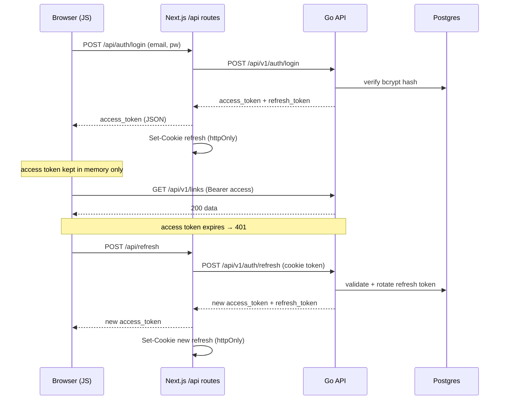
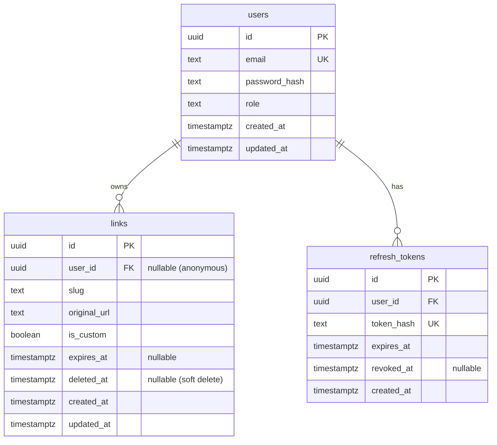

# Architecture

This document explains how shrt is put together: the high-level components, the
request flows that matter (redirect, auth), the data model, and the key design
decisions behind them. For the endpoint contract see [API.md](API.md); for the
full product/milestone plan see [`IMPLEMENTATION-PLAN.md`](../IMPLEMENTATION-PLAN.md).

## System overview

shrt is two deployable units — a Go backend and a Next.js frontend — backed by
Postgres and Redis.



The Go program is a **single binary** that serves both the JSON API and the
public redirect endpoint. There is intentionally **no service layer**: HTTP
handlers in `server/` only parse requests and write responses, while all business
logic — slug generation, caching, Safe Browsing, password hashing, token
issuance — lives in `store/`.

## Backend package layout

```
backend/
├── cmd/shrt/main.go     # entry point: load config, build store + server, serve
├── server/              # HTTP layer only
│   ├── server.go        # router, middleware wiring, timeouts
│   ├── auth.go          # register / login / refresh / logout handlers
│   ├── link.go          # link CRUD handlers
│   ├── redirect.go      # GET /:slug
│   ├── middleware.go    # auth (require/optional), rate limit, CORS
│   └── response.go      # JSON helpers + sentinel-error → HTTP mapping
├── store/               # business logic + data access
│   ├── store.go         # Store struct (pgx pool + redis + keys), New()
│   ├── link.go          # slug gen, cache-aside, Safe Browsing, CRUD
│   ├── user.go          # register / login (bcrypt)
│   ├── token.go         # JWT sign/parse, refresh-token issue/rotate/revoke
│   └── errors.go        # sentinel errors
├── internal/config/     # env loading — the only place os.Getenv is used
└── db/
    ├── migrations/      # golang-migrate SQL
    └── queries/         # sqlc source (generated code is committed, never edited)
```

**Dependency direction:** `cmd` → `server` → `store` → `db`. The `server` layer
depends on `store`; `store` never imports `server`. Configuration flows in as a
typed `*config.Config` built once at startup, so nothing else reads the
environment.

## Redirect flow (the hot path)

The redirect is the highest-traffic path, so it reads through a Redis cache
before touching Postgres.



Key properties:

- **Cache key:** `slug:<slug>` → the original URL (plus expiry metadata).
- **TTL:** `expires_at − now`, or 24h for links with no expiry.
- **Fail-open:** a Redis error never blocks a redirect — the handler logs a
  warning and falls through to Postgres.
- **Status codes:** links with an expiry always use `302` (so browsers don't
  cache them past their lifetime); permanent links use `DEFAULT_REDIRECT_CODE`
  (301 or 302). Unknown/deleted → `404`; expired → `410`.
- **Soft deletes + slug recycling:** the unique index on `slug` is partial
  (`WHERE deleted_at IS NULL`), so a deleted slug can be reused as a new alias.

## Authentication & token flow

Auth uses JWT access tokens (RS256) plus opaque, rotating refresh tokens. The web
client keeps the access token in memory and never exposes the refresh token to
JavaScript — the Next.js server holds it in an httpOnly cookie.



Key properties:

- **Access token:** RS256-signed JWT, default 1h. `sub` = user ID, plus a `role`
  claim. Verified on each request by the auth middleware.
- **Refresh token:** 32 random bytes, default 30d. Only its **SHA-256 hash** is
  stored. On every refresh the presented token is revoked and a new one issued
  (**rotation**), so a leaked refresh token can't be reused after a legitimate
  refresh.
- **Optional auth:** `POST /api/v1/links` accepts both anonymous and
  authenticated callers — a valid token associates the new link with the user; a
  missing/invalid token is treated as anonymous, not rejected.
- **Password hashing:** bcrypt, cost 12. Unknown-email logins still run a bcrypt
  comparison so response timing doesn't reveal whether an account exists.

## Data model



Notes:

- `links.user_id` is nullable and `ON DELETE SET NULL` — anonymous links have no
  owner, and deleting a user orphans rather than removes their links.
- `refresh_tokens.user_id` is `ON DELETE CASCADE` — tokens die with the user.
- A **partial unique index** on `links(slug) WHERE deleted_at IS NULL` enforces
  slug uniqueness only among active links.
- All ownership queries are scoped by `user_id`, so another user's link is
  indistinguishable from a nonexistent one (returns `404`, never `403`).

## Cross-cutting concerns

- **Rate limiting** — `POST /api/v1/links` uses a Redis `INCR` + `EXPIRE` fixed
  window (1h), keyed by user ID (authenticated) or client IP (anonymous). Fails
  open on a Redis outage.
- **CORS** — only the configured `FRONTEND_URL` origin is allowed; credentials
  are permitted for the cookie-based auth flow.
- **Safe Browsing** — checked before insert when `SAFE_BROWSING_API_KEY` is set;
  skipped (with a warning) otherwise, so local dev needs no key.
- **Config** — loaded once into a typed struct; the app panics at startup if a
  required variable is missing, rather than running half-configured.
- **HTTP server** — all timeouts set (read-header, read, write, idle); intended
  to run behind a trusted reverse proxy that terminates TLS and sets
  `X-Forwarded-For`.

## Frontend architecture

The Next.js app (App Router) is Server Components by default. State and data
concerns are deliberately separated:

- **`lib/api.ts`** — the only place the browser calls `fetch`. Attaches the
  Bearer token, parses the error envelope into a typed `ApiError`, and performs a
  single silent refresh-and-retry on `401`.
- **`hooks/use-links.ts`** — all server state via TanStack Query, with a
  `linkKeys` factory for cache-key management.
- **`hooks/use-auth.tsx`** — auth state (Context + reducer) with a silent refresh
  on app load to restore the session.
- **`app/api/*`** — server-side route handlers that own the httpOnly refresh
  cookie and proxy auth to the Go backend.

See [`frontend/CLAUDE.md`](../frontend/CLAUDE.md) for the frontend coding
standards.
